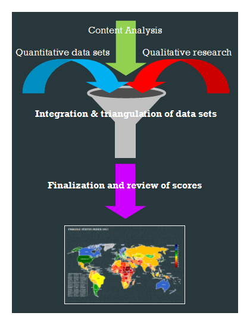
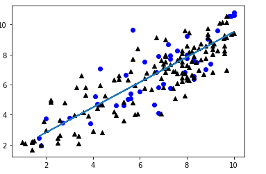
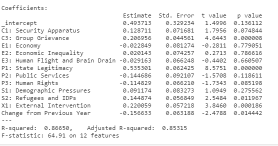

# Scratching the surface of social cohesion
 
## Purpose: This data serves Economists, Government agencies and Non-governmental agencies both within the country and outside as a baseline for level of risk.  Without this kind of data governments may have a delayed response to the urgent needs of their nation. This is also a useful resource to organizations that provide intervention services both within their country and internationally. It’s especially important to predict potential volatility.

## Why I chose this topic?
Timeliness 
This has been a topic of interest to me, for a while. I experience and see the world differently from a young age I have had to balance two very different worldviews, and the two countries that have shaped my identity happen to be experiencing a heightened level of social and political polarization at this time – especially in 2020.  

What makes a cohesive nation? 
How is social cohesion measured?  In my dataset there are 12 indicators identified in the Fragile State Index, and each of them have an assigned value for each of the 178 countries. The nations are ranked with #1 being the least cohesive least stable country, and 178 as the most stable most cohesive country. 
## 12 Indicators:
●	C1: Security Apparatus -security threats to a state, such as bombings, attacks and battle-related deaths, rebel movements, mutinies, coups, or terrorism

●	C2: Factionalized Elites -fragmentation of state institutions along ethnic, class, clan, racial or religious lines, as well as and brinksmanship and gridlock between ruling elites.

●	C3: Group Grievance - focuses on divisions and schisms between different groups in society – particularly divisions based on social or political characteristics – and their role in access to services or resources, and inclusion in the political process.

●	E1: Economic Decline &Poverty - factors related to economic decline within a country
 
●	E2: Uneven Economic Development - inequality within the economy, irrespective of the actual performance of an economy

●	E3: Human Flight & Brain Drain - voluntary emigration of the middle class – particularly economically productive segments of the population, due to economic deterioration 

●	P1: State Legitimacy - representativeness and openness of government and its relationship with its citizenry

●	P2: Public Services - essential services, such as health, education, water and sanitation, transport infrastructure, electricity and power, and internet and connectivity

●	P3: Human Rights & Rule of Law - fundamental human rights are protected and freedoms are observed and respected.
The Indicator looks at whether there is widespread abuse of legal, political and social rights, including those of individuals, groups and institutions (e.g. harassment of the press, politicization of the judiciary, internal use of military for political ends, repression of political opponents

●	S1: Demographic Pressures - measures population pressures related to food supply, access to safe water, and other life-sustaining resources, or health, such as prevalence of disease and epidemics

●	S2: Refugees & IDPs Internally Displaced Persons - measures the pressure upon states caused by the forced displacement of large communities as a result of social, political, environmental or other causes, measuring displacement within countries, as well as refugee flows into others. 

●	X1: External Intervention - focuses on security aspects of engagement from external actors, both covert and overt, in the internal affairs of a state at risk by governments, armies, intelligence services, identity groups, or other entities

The owner of the data, Fund For Peace, an NGO has collected data on several countries and their data set spans from year 2006-2020 – they have covered a total of 15 years and will begin working on 2020 data to be published in the Spring of 2021. I wanted to understand how they collected their data. I needed more understanding about their primary data sources and their process. and I was able to reach Nate Haken, the Programs Director at Fund For Peace. He shared invaluable information that I wouldn’t have been able to obtain from just looking at the website. They have a unique set of data and I was excited to find this information that spans over a decade. Especially the content and factors that they analyzed were closely related to my topic of interest.

In order to understand social cohesion you have to consider the opposite end of the spectrum, which is instability and polarization. Many of the indicators mentioned can be described as polarization metrics; cause & effects of polarization in a society. A large part of the data is captured by analyzing media coverage. 

## Data Source: used to construct the data was headed by Fund for Peace. Data analysts triangulated three different data streams to measure the 12 indicators using 1) primary data from the World Bank and UNHCR – United Nations High Commissions for Refugees, etc. 2) Content analysis of millions of online public documents using Boolean search strings to flag sharp changes from one country to the next, and 3) qualitative assessment. The approach taken is to scale and normalize the individual metrics and then integrate with weighted averages. 

For the qualitative component, two separate teams of analysts independently conduct a qualitative analysis to assess, based on major events, whether the country indicator scores got better, worse, or stayed the same.  The qualitative analysis is done twice, by two different sets of analysts with a firewall between them, to reduce bias and fill gaps.
Finally the three data streams are compared to see if they generate the same outcome, and triangulated to arrive at a reconciled score.
The methodology was pretty consistent for each year, beginning with 147 countries in 2006 and expanding to a total of 178 countries on their current list.

The hypothesis - Countries considered to be stable and have a ranking in the 170s have minimal grievances and minimal human rights violations. 
Social Cohesion defined - the absence of polarization and division. 'Stable' or 'Very stable nations'.
Which indicators are most correlated?
Are Countries with a low rating of E1: Economic Decline & Poverty likely to have minimal grievances and human rights violations?

#Extracting, Transforming, and Loading

The data sheets provided were organized by year and the first python notebook was based on the fsi-2020 excell data.  However, I merged the years and created an excell sheet that compiled all years 2006 - 2020

Create numeric_columns variables
X = df.drop(['Country', 'Year','Total', 'Rank', 'C2: Factionalized Elites'], axis=1)
X 

scaler = MinMaxScaler()
scaler.fit(X_train)
X_train_scaled = scaler.transform(X_train)
X_test_scaled = scaler.transform(X_test)

nn_model = tf.keras.models.Sequential()
nn_model.add(tf.keras.layers.Dense(units=len(X.columns) * 2, activation = "relu", input_dim = len(X.columns)))
nn_model.add(tf.keras.layers.Dense(units=1, activation="linear"))
nn_model.summary()

#Model: "sequential"
_________________________________________________________________
Layer (type)                 Output Shape              Param #   
=================================================================
dense (Dense)                (None, 24)                312       
_________________________________________________________________
dense_1 (Dense)              (None, 1)                 25        
=================================================================
Total params: 337
Trainable params: 337

nn_model.compile(loss="mean_squared_error", optimizer="adam")
nn_model.fit(X_train_scaled, np.asarray(y_train), epochs=100)
Epoch 100/100
5/5 [==============================] - 0s 571us/step - loss: 1.4916
<tensorflow.python.keras.callbacks.History at 0x259f49e2400>

y_train_pred = nn_model.predict(X_train_scaled)
y_test_pred = nn_model.predict(X_test_scaled)
r2_score(y_train, y_train_pred)
0.7520758614637557

r2_score(y_test, y_test_pred)
0.6703319673070454

## Regression relationship with Cohesion data

## My testing method: Supervised ML, Regression & Linear Regression. 
Keras sequential, nn-model, deep-model, and linear regression
Results for target metric Fractionalized Elites (primary target metric)
○	Nn model: R² value for y_train = .76 and y_test = .66
○	Deep model: R² value for y_train = .80 and y_test .70
The results were slightly varied due to the nature of the algorithm but the average accuracy score across different indicators is 82%. 
P-value – testing the null hypothesis

# Findings

Similar outcomes for both train and test. The indicators that were most corelated to Fractionalized elites were: P1: State Legitimacy and 
C3: Group Grievance and 
X1: External Intervention

Libaries: Pandas, Numpy, Tensorflow, Sklearn (preprocessing, model_slection, metrics, linear model, and matplotlib.

DASHBOARD
Tableau Animation - 2006 to 2020 data 
https://public.tableau.com/profile/tsedey.aragie#!/vizhome/DataViz_fragilestateindex/C-indicators

Challenges and Difficulties Encountered: The data was pretty clean but interpreting and finding the most influential and most correlated indicators took a little maneuvering. The Indicators that were most correlated were C3: Grievances, X1: External Intervention, C2: Factionalized Elites, S2: Refugees and IDPs, and P1: State Legitimacy. It would be interesting to compare a test and train sample for public documents in the languages of the countries being analyzed. 

